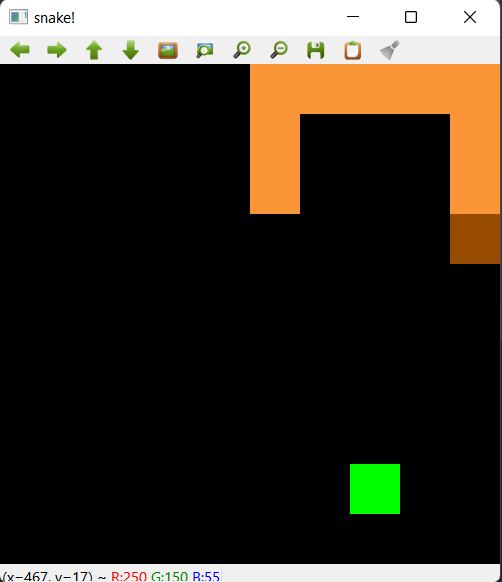
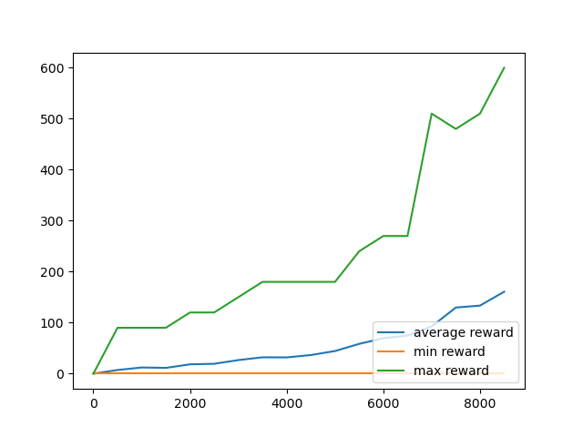

# Intelligent Snake! 
A Snake game is implemented in `env.py` which is a game looking like the image below.
In the game, in each step the snake can decide to do nothing (go forward), turn right, or turn left. It will lose if it
touches itself or the walls around. The green point is food and his length will grow by one unit if he eats it.
When the food is eaten, it will immediately respawn in a free random place.

An RL agent is implemented in `DQNAgent.py` and you can start training this agent in `main.py`. It uses Deep Q Learning.

Also some trained models are available in `models` directory. You can give the address of these models to the agent 
as its second parameter when building the agent and the agent will use that model. 

In the snake game, each move is rewarded 0 unless the snake eats the food for which he (or she?!) is rewarded 30.
All these numbers can be changed in the `env.py` file.

Currently, the best available model is the one at `models/2conv___600.00max__160.68avg____0.00min__1658520478.model` and 
its stats can be seen below. It has been trained for 5 hours and the snake played the game for 8500 times! :)

As you can see in the plot above, the snake was able to eat the food around 5 times before losing in average and there 
were times that it was able to eat the food for 20 times!
